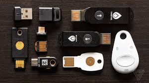
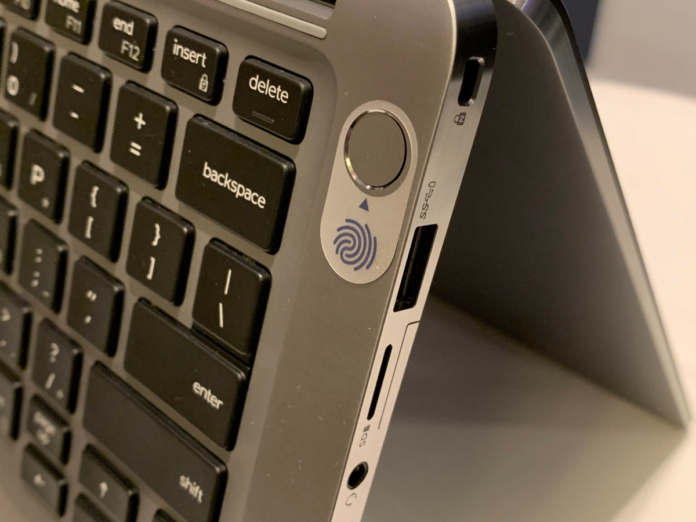

# Authenticators

An Authenticator is a cryptographic entity used to generate a public key credential and registered by a Relaying Party \(i.e. an application\). This public key is used to authenticate by potentially verifying a user in the form of an authentication assertion and other data.

Authenticators may have additional features such as PIN code or biometric sensors \(fingerprint, facial recognition…\) that offer user verification.

## Roaming Authenticators

The roaming authenticator may have different forms. The most common form is a USB device the user plugs into its computer. It can be a paired Bluetooth device or a card with NFC capabilities.

Authenticators of this class are removable from, and can "roam" among, client devices.

## Platform Authenticators

A platform authenticator is usually not removable from the client device. For example an Android smartphone or a Windows 10 computer with the associated security chips can act as an authenticator.

