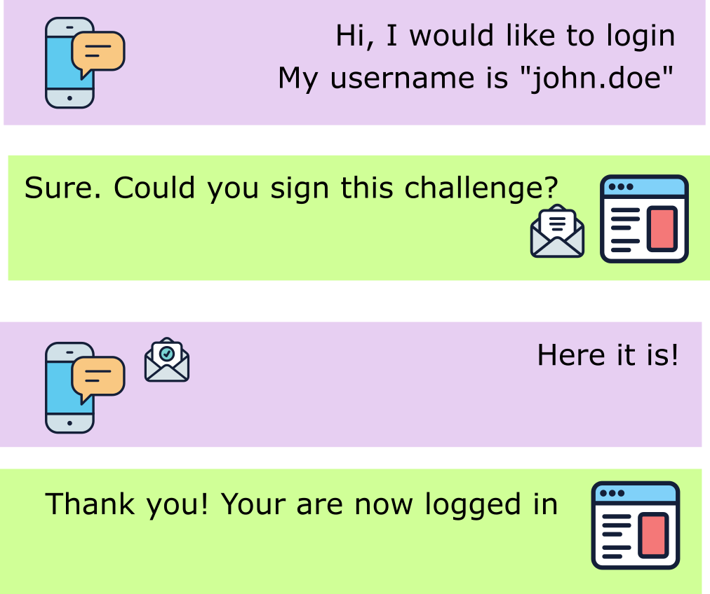

# Ceremonies

In the Webauthn context, there are two ceremonies:

* The attestation ceremony
* The assertion ceremony: it is used for the authentication of a user.

For both ceremonies, there are two steps to perform:

1. The creation of options: these options are sent to the authenticator and indicate what to do and how.
2. The response of the authenticator: after the user interacted with the authenticator, the authenticator computes a response that has to be verified.

Depending on the options and the capabilities of the authenticator, the user interaction may differ. It can be a simple touch on a button or a complete authentication using biometric means (PIN code, fingerprint, facial recognition…).

## Attestation ceremony

This ceremony aims at registering an authenticator. It can be used during the creation of a new user account or when an existing user wants to add an additional authenticator.

## Assertion ceremony

This ceremony aims at authenticating a user. The user will be asked to interact with one of its authenticators. Additional authentication means, such as PIN code or fingerprint, may be required.

